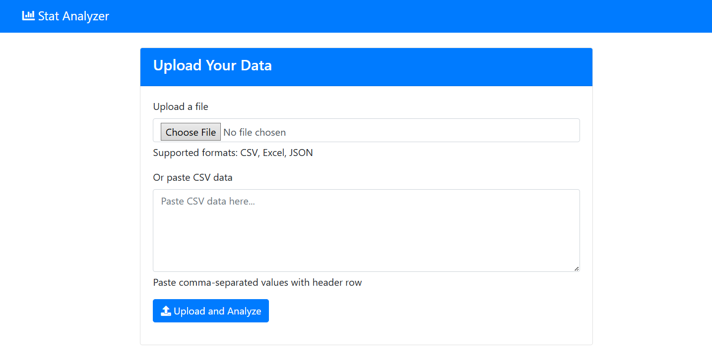
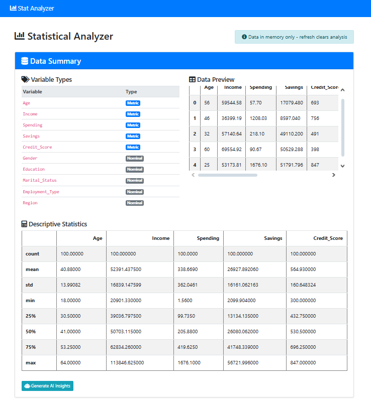
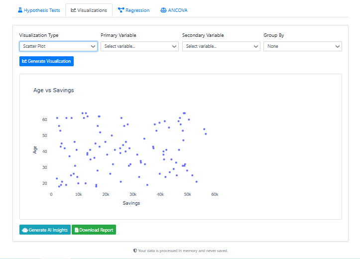

# StatAnalyzer Pro  
[](https://www.python.org/)  
[](https://www.djangoproject.com/)  
[](https://opensource.org/licenses/MIT)  

  
  
  
**StatAnalyzer Pro** is a web-based statistical analysis tool that allows users to upload datasets and perform various statistical analyses, including hypothesis testing, regression modeling, visualization, and more. Built with Django and Python, it provides an intuitive interface for data exploration and statistical analysis.

---

## 🚀 Features

- **Data Upload**: Supports CSV, Excel (XLSX), and JSON formats  
- **Data Summary**: Automatic variable type detection and descriptive statistics  
- **Hypothesis Testing**:
  - Independent T-Test
  - One-Way ANOVA
  - Chi-Square Test
  - Mann-Whitney U Test  
- **Regression Analysis**:
  - Linear Regression with VIF diagnostics
  - Logistic Regression with performance metrics  
- **Visualizations**:
  - Histograms
  - Box Plots
  - Scatter Plots
  - Correlation Matrices  
- **ANCOVA**: Analysis of Covariance  
- **AI Insights**: Automated interpretation of results  
- **Report Generation**: Download PDF reports of your analyses  

---

## 📦 Installation

### Prerequisites

- Python 3.8+
- pip
- virtualenv (recommended)

### Setup

1. Clone the repository:

   ```bash
   git clone https://github.com/fkaan/Statistics-Calculator.git
   cd stat-analyzer
   ```

2. Create and activate a virtual environment:

   ```bash
   python -m venv venv
   source venv/bin/activate  # On Linux/macOS
   # On Windows:
   # venv\Scripts\activate
   ```

3. Install dependencies:

   ```bash
   pip install -r requirements.txt
   ```

4. Apply migrations:

   ```bash
   python manage.py migrate
   ```

5. Create a superuser (optional):

   ```bash
   python manage.py createsuperuser
   ```

6. Run the development server:

   ```bash
   python manage.py runserver
   ```

7. Open in your browser:

   ```
   http://localhost:8000
   ```

---

## 🧪 Usage

### Upload Your Data

- Navigate to the home page
- Upload your dataset file or paste CSV data
- Click "Analyze Now"

### Explore Data Summary

- View variable types and descriptive statistics
- Examine data preview

### Perform Analyses

- Use the tabs to navigate between different analysis types
- Select variables and parameters for each test
- Click "Run Analysis" to see results

### Generate Reports

- After any analysis, click "Download Report" to get a PDF
- Use "Generate AI Insights" for automated interpretation

### Start Over

- Click "Upload New Data" to analyze a different dataset

---

## ⚙️ Technical Stack

- **Backend**: Django (Python)
- **Frontend**: Bootstrap 4, jQuery
- **Data Analysis**: Pandas, NumPy, SciPy, Statsmodels, scikit-learn
- **Visualization**: Plotly
- **PDF Generation**: ReportLab
- **AI Integration**: OpenAI API (optional)

---

## 📁 Project Structure

```
stat-analyzer/
├── analyzer/               # Main Django app
│   ├── migrations/         # Database migrations
│   ├── static/             # Static files (CSS, JS, images)
│   ├── templates/          # HTML templates
│   ├── utils/              # Utility functions
│   ├── admin.py            # Admin configuration
│   ├── apps.py             # App configuration
│   ├── forms.py            # Form definitions
│   ├── models.py           # Database models
│   ├── urls.py             # URL routing
│   └── views.py            # View functions
├── stat_analyzer/          # Project configuration
│   ├── settings.py         # Django settings
│   ├── urls.py             # Main URL routing
│   └── wsgi.py             # WSGI configuration
├── requirements.txt        # Python dependencies
└── manage.py               # Django management script
```

---

## 🔐 Configuration

Create a `.env` file in your project root with the following variables (if needed):

```env
DEBUG=True
SECRET_KEY=your-secret-key-here
OPENAI_API_KEY=your-api-key-if-using-ai  # Optional
```

---

## 🤝 Contributing

Contributions are welcome! Please follow these steps:

1. Fork the repository  
2. Create a new branch:  
   ```bash
   git checkout -b feature-branch
   ```
3. Make your changes and commit:  
   ```bash
   git commit -am 'Add new feature'
   ```
4. Push to the branch:  
   ```bash
   git push origin feature-branch
   ```
5. Create a new Pull Request

---

## 📄 License

This project is licensed under the MIT License - see the [LICENSE](LICENSE) file for details.

---


## 🔮 Future Improvements

- Add time series analysis capabilities  
- Implement user accounts to save analysis history  
- Add more visualization options  
- Support for larger datasets with pagination  
- Dockerize the application for easier deployment  

---

## 📌 Recommended Badges (Already Included)

```markdown
[](https://www.python.org/)
[](https://www.djangoproject.com/)
[](https://opensource.org/licenses/MIT)
```

You can add these right under the title as already shown.

---

Built with ❤️ for data scientists, researchers, and students.
